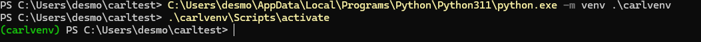

## Project Requirements 
1. Python 3.11.2
    - You can install it [here](https://www.python.org/downloads/release/python-3112/)
    - If you already have Python installed, and you need to keep the "python" alias attached to that version, unclick "Add Python to PATH" during the install process
    - Check your current python version by opening a terminal and typing `python --version`
2. Git
   - Get installer [here](https://git-scm.com/downloads/guis)
   - You will have to deal with a lot of hassle in order to get updated code if you're not already 
   added to the repository, so please email Desmond Harris(dkharr05@louisville.edu) get added
## Install Instructions
1. **Clone the repository**\
`git clone https://github.com/desmondharris/CARL.git`
   - **Make sure you are in the directory you want the project installed to**
   - If you're added to repo, add the remote repo in order to later pull updates\
   `git remote add https://github.com/desmondharris/CARL.git` 
2. **Create the VENV**
   - Navigate to the CARL directory\
   `cd CARL` 
   - If you added Python 3.11.2 to PATH:\
   `python -m venv .\carlvenv`
   - If not, your Python executable should be located in at `C:\Users\$YOURUSERNAME\AppData\Local\Programs\Python\Python311`
   - Copy this path and add `\python.exe` to it
   - Create the venv\
   `C:\Users\$YOURUSERNAME\AppData\Local\Programs\Python\Python311\python.exe -m venv .\carlvenv`
3. **Activate the VENV**\
   `.\carlvenv\Scripts\Activate`\
\
At this point, your terminal window should appear something like this:

The green (carlvenv) means that the project virtual environment is active. If it's not appearing, something's gone wrong during the install process.
Try restarting, and if you run into issues contact Desmond Harris on Teams or email.

4. **Install required libraries** \
   - `pip install -r requirements.txt` \
   This may take a few minutes. Depending on your computer, the install may raise several warnings which can be ignored. If 
   you are unable to run code, send me a picture of the errors/warnings and I'll try and help you.
   - Verify the install by running `pip list`. The expected ouput is a long list of packages that should include TensorFlow, PyLSL, NumPy, and MatPlotLib.
   
5. Set up your files as needed
   - Many of the files(at least the ones I wrote) have debug flags at the top of the file which may change the behavior of the program if set to true

